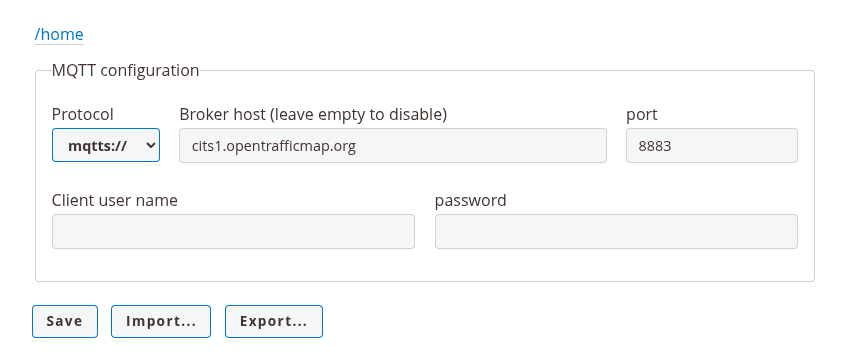

# its-g5-receiver
Simple ITS-G5 receiver for ITS-G5 802.11p frames.

This part is the MQTT bridge.
It receives frames from the esp32-c5 acting as sniffer and forwards them over MQTT.


## Compiling bridge firmware

- If you don't already have a Python virtual environment, create one:

  ```bash
  python -m venv .venv
  ```

- Activate the virtual environment:

  ```bash
  source .venv/bin/activate
  ```

- Install PlatformIO in the virtual environment:

  ```bash
  pip install platformio
  ```

## Programming firmware
Make sure the virtual environment is activated (see above).

First, make sure the firmware can compile:
```bash
pio run
```

Upload the internal file system contents (web server files, root certificate):
```bash
pio run -t uploadfs
```

Finally, upload the firmware:
```bash
pio run -t upload
```

## Configuration

The bridge connects over WiFi to the opentrafficmap MQTT server over the internet, so you need to configure some things first.

### WiFi configuration
The WiFi credentials need to be set first.
Power on the esp32-c3 and insert a USB-cable into the esp32-c3.
Then open a terminal towards it, for example, from the esp32-c3-bridge source directory :
```bash
pio device monitor
```

This allows access to a simple command line processor.
To set the wifi credentials, type CLI command:
```
wifi <your-ssid> <ssid-password>
```
Credentials are saved on the esp32-c3 internal non-volatile memory.

You can check connection status using the CLI command:
```
wifi
```
This also shows a link to an internal web page, e.g. http://192.168.1.52

### MQTT configuration
Open the link mentioned above in a browser to enter the configuration web page.



On the configuration web page, you can enter MQTT information.

Typically for opentrafficmap.org:
* Protocol: mqtts
* Broker host: cits1.opentrafficmap.org
* Port: 8883
* Client user name and password: leave empty
* Press Save when done entering data, or after importing from an external file

## Use
Power can be provided either through the USB-C port, or through the 5V / GND connection from the esp32-c5 sniffer board.

The LED starts blue while initializing the WiFi and MQTT connections.
It turns off when the connection to the MQTT server has been established.

The LED briefly flashes blue on reception and processing of a packet from the esp32-c5 sniffer.
